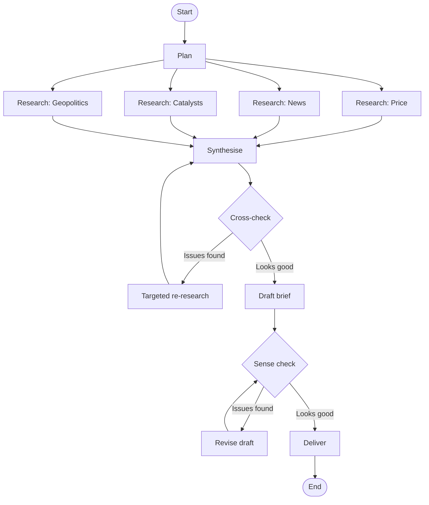

# 03 — Graph and state design

## What I did

Designed the full graph topology and state schema for the briefing agent
before writing a single line of LangGraph code. No code in this step —
just a documented design that's ready to implement.

The decisions, in order:

1. **Output spec.** Four-section daily briefing: price action, overnight
   news and sentiment, today's catalysts, geopolitics and structural
   drivers. All four sections are interpretive, not informational — the
   agent forms a view, not just a digest.

2. **Workflow.** Mapped my "if I were doing this by hand" workflow into a
   graph: research in parallel, synthesise, cross-check, draft, sense
   check, deliver. Two feedback loops — one after cross-check (data
   integrity), one after sense-check (prose quality).

3. **Topology.** 12 nodes total. Single re-research path rather than
   four return paths from cross-check (deliberate simplification — see
   the corresponding ADR).

4. **State.** 18 fields. Only one needs a non-default reducer (`errors`,
   which uses list append).

5. **Operational vs audit principle.** Established that fields driving
   "what happens next" replace on update; fields recording "what has
   happened" append. For Phase 1, no audit fields in state — LangSmith
   traces handle that.

## What I learned

### Design starts with the output

The single most useful thing I did this step was articulate what a "good"
brief looks like before designing the graph. Each section got a one- or
two-sentence definition of the editorial intent. Without that, the graph
would be designed around vibes rather than a target.

The "what good looks like" definitions become the rubric the Drafter and
Critic nodes use, so they're not just helpful framing — they're prompt
material.

### Designing topology is just describing your own workflow

I wrote down what I'd do as a human writing tomorrow morning's brief, in
plain English, in six steps. That mapped almost cleanly onto graph nodes.
The discipline of describing human workflow first means nodes get named
after units of work ("Cross-check," "Synthesise") rather than services
("BedrockClaudeNode," "TavilyNode"). The first kind of naming is a
design; the second is technical garbage.

### State is shared, not function-IO

Big mental shift. I initially thought of nodes as having their own inputs
and outputs, like function signatures. They don't. There is one State
object that lives for the whole graph run. Every node reads from it and
returns updates to it. The graph applies the updates and passes the
larger State to the next node.

Why this matters: if a critic three nodes downstream needs access to
something the planner produced, shared state makes that trivial. With
function-IO you'd have to thread the value through every intermediate
node. The shared state model is what lets graphs do non-linear control
flow without becoming a parameter-passing nightmare.

### Reducers handle "what happens when a field gets written more than once"

Default behaviour is replacement: each write overwrites the previous
value. For most fields this is what you want.

For some fields — typically lists that get contributed to from multiple
places — you want append. LangGraph expresses this through the type
annotation on the field:

```python
errors: Annotated[list[str], add]
```

The `add` here is `operator.add`, which for lists means concatenation.

Built-in reducer worth knowing about: `add_messages` from
`langgraph.graph.message`. Smarter than `add` for chat history because it
deduplicates by message ID. We don't need it for our graph (no message
history flowing through state), but every quickstart uses it.

### Operational vs audit state

The conceptual breakthrough of the step. Some state fields drive what
happens *next* — the conditional edge reads them to make routing
decisions, the next node reads them to know what to do. Those are
operational. They should be current; replacement is the right semantics.

Other state fields exist to *record what happened* — error logs, attempt
history, prior drafts. Those are audit. Append is the right semantics.

Conflating the two roles is the most common state design bug. If you
make `re_research_targets` accumulate history (audit semantics), the
re-research node will read the accumulated list and re-research already-
fixed issues. The field has lost its operational meaning.

For Phase 1, LangSmith traces serve as the audit log. I'm deliberately
keeping no audit fields in state — they're cheap to add later if a
specific need emerges, and trying to build them preemptively just makes
state larger without earning its keep.

## The output spec

Four sections, each with a defined editorial purpose:

1. **Price action.** A few sentences on yesterday's close and overall
   direction; the day's range. Compare to recent trend and offer a view
   on whether today continues or breaks it. Close with the news or
   events that explain the movement.

2. **Overnight news and sentiment.** Highlight the key news that will
   either continue the trend or change direction. Classify each:
   short-term reactionary vs longer-term structural.

3. **Today's catalysts.** List scheduled events (EIA inventory, OPEC
   meetings, earnings if relevant). For each, note the expected outcome
   and what would constitute a surprise. Flag the ones most worth
   watching.

4. **Geopolitics and structural drivers.** Macro context — trading
   flows, exploration, extraction, refinement, supply chain. Insights,
   not headlines.

Total target length: roughly 300-500 words.

## The graph topology



Notes on what's in the diagram:

- Square nodes are work-doing nodes; diamond nodes are decision nodes
  (where conditional routing happens).
- The `Synthesise → Cross-check → ReResearch → Synthesise` loop bounds
  data quality.
- The `SenseCheck → Revise → SenseCheck` loop bounds prose quality.
- Both loops will need retry caps in state (`cross_check_attempts`,
  `sense_check_attempts`) to prevent infinite looping on edge cases.

## The state schema

| Field | Type | Reducer | Written by | Purpose |
|---|---|---|---|---|
| `target_date` | str (ISO) | replace | input | Today's date |
| `commodity` | str | replace | input | What we're briefing on |
| `briefing_spec` | dict | replace | input | Editorial spec (4 sections, rubric) |
| `research_plan` | dict | replace | Plan | Per-stream research instructions |
| `price_research` | str/dict | replace | Research: Price | Findings on price action |
| `news_research` | str/dict | replace | Research: News | Findings on overnight news |
| `catalyst_research` | str/dict | replace | Research: Catalysts | Findings on today's events |
| `geo_research` | str/dict | replace | Research: Geopolitics | Findings on macro drivers |
| `errors` | list[str] | **add** | any node, on failure | Accumulated non-fatal errors |
| `synthesis` | str | replace | Synthesise | Coherent picture from all research |
| `cross_check_result` | dict | replace | Cross-check | Pass/fail + reasoning |
| `re_research_targets` | list[str] | replace | Cross-check | What to re-research (cleared after) |
| `cross_check_attempts` | int | replace | Cross-check | Loop counter |
| `draft` | str | replace | Draft / Revise | Current draft of brief |
| `sense_check_result` | dict | replace | Sense check | Pass/fail + reasoning |
| `revision_notes` | list[str] | replace | Sense check | What to fix in next revision |
| `sense_check_attempts` | int | replace | Sense check | Loop counter |
| `final_brief` | str | replace | Deliver | The deliverable |

Briefing spec lives in state (not as a constant) because it positions us
to support multiple commodities later without refactoring.

## What surprised me

- A "graph" in LangGraph is conceptually much simpler than the name
  suggests. It's just state plus nodes plus edges, with no fancy
  algorithmic content. The complexity is in the *application* of the
  pattern, not the pattern itself.

- The discipline of "describe your human workflow first" feels obvious
  in retrospect. I haven't seen it in any LangGraph quickstart — they
  all jump to nodes immediately, which is why so many tutorial graphs
  feel arbitrary.

- 18 state fields seems like a lot until I realised every one has a
  clear writer and clear readers. State for a graph with two loops
  genuinely needs this much. Most beginners under-design state, then
  add fields ad-hoc as bugs surface.

## Open questions

- The exact shape of the four research outputs — strings, structured
  dicts, or something LangChain-specific? Will probably end up
  structured because the synthesiser needs to inspect them.

- How `briefing_spec` actually gets loaded into initial state. Probably
  from a YAML file, but TBD.

- The retry caps for the two loops — should be configurable, but what
  defaults? Two seems sensible. If it fires more than that the agent
  has a bigger problem than topology.

## Glossary

- **Topology** — The shape of the graph: which nodes exist and how
  they're connected.
- **State** — The single shared dict (TypedDict in 1.0) that flows
  through the graph. Read by every node, written to by nodes that
  produce something.
- **Reducer** — Function attached to a state field that defines how
  multiple writes combine. Default is replacement; common alternative
  is append.
- **Operational state** — Fields whose value drives next-step
  behaviour. Should be current; replacement is the right semantics.
- **Audit state** — Fields whose value records history. Append is the
  right semantics. For Phase 1, none in state — LangSmith handles it.
- **Conditional edge** — Edge whose destination is decided at runtime
  by a routing function reading state. Distinct from a regular edge,
  which always goes to the same destination.
- **Fan-out / fan-in** — Topology pattern where one node spawns
  multiple parallel nodes that later converge. Our four research nodes
  are fan-out from Plan, fan-in to Synthesise.
