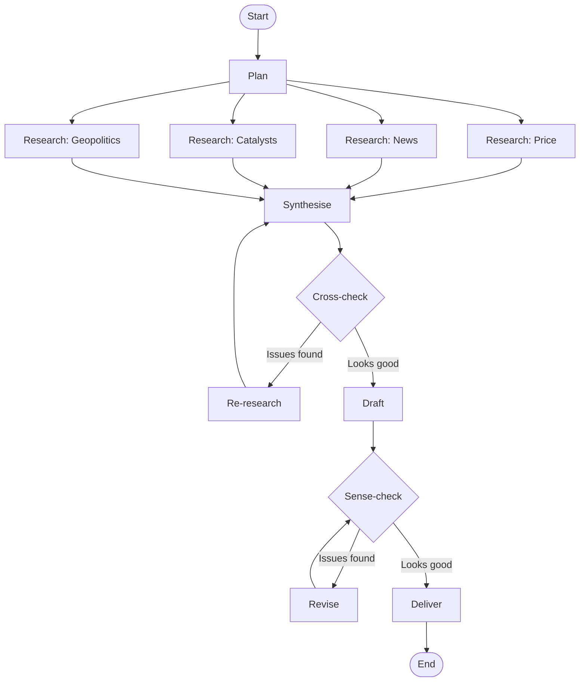

# STEP-13 — Architecture: the LangGraph implementation, and what comes next

## What I did

This isn't a new feature step. It's the architecture write-up — the
patterns that crystallised across the previous nine steps, and the
honest framing of where the project actually sits.

Phase 1 is the LangGraph implementation. It's complete. But the
project as a whole is **the same agent built on three architectures**:

- **Phase 1**: LangGraph + Anthropic API direct (this implementation)
- **Phase 2**: Strands Agents on Bedrock AgentCore Runtime, Claude
  via Bedrock
- **Phase 3**: Vertex AI Agent Engine, Gemini via Vertex

The point of the project isn't "ship a working agent." It's testing
whether the conceptual design — state-first, schema-as-contract,
bounded feedback loops, two-stage analyse-then-render — actually
ports across architectures, or whether it's secretly LangGraph-shaped.

Phase 1 gave us one data point. Phases 2 and 3 will tell us whether
the design generalises.

## What I learned (in Phase 1)

These are observations about the LangGraph implementation specifically.
Whether they hold up as architecture-level lessons or were
LangGraph-specific is exactly what Phase 2 will test.

### State design felt like the whole game

The single most consequential thing I did in Phase 1 was design the
State schema in STEP-03 *before writing any nodes.* 18 fields, each
with a clear writer and clear readers, with the operational/audit
distinction explicit.

Because state was right, every subsequent node was small. Each node
just reads what it needs and writes what it owns. The hard work of
"how does this node communicate with that one" is absorbed by the
schema.

**Open question for Phase 2**: does Strands have an analogous "state"
primitive? If not — if Strands models inter-node communication via
function arguments or message-passing — does the agent stay this
clean? Or does the lack of a centralised state schema force the
design to fragment?

### Schema-as-contract carried more weight than I expected

Every LLM call in Phase 1 uses `with_structured_output` against a
TypedDict. Every research output, audit result, and rendered brief is
schema-typed at the provider level. JSON-parsing problems I expected
to debug never materialised; the provider-level structured-output
mechanism was rock-solid.

**Open question for Phase 2**: Bedrock supports tool-use-based
structured output, but the API surface is different from LangChain's
abstraction. Does the same pattern (one schema per LLM call,
schema-typed inter-node communication) survive when you have to wire
it up against Bedrock's `Converse` API directly? Or does the
boilerplate become heavy enough that some other pattern wins?

### `with_structured_output` was the workhorse; agent loops were the exception

Twelve nodes. Eleven used simple LangChain patterns (`with_structured_output`
or `bind_tools + with_structured_output`). One used `create_agent`
and was eventually migrated to the simpler pattern.

The principle that crystallised: default to the simpler pattern;
reach for agent loops only when the task genuinely needs iterative
reason-act-observe cycles. Most "research" tasks don't.

**Open question for Phase 2**: Strands is built around the agent-loop
abstraction more centrally than LangGraph is. Will the "default to
simpler patterns" lesson translate, or will Strands push the design
toward more loop-shaped nodes? If the framework's defaults shape the
architecture, that's a finding.

### Bounded loops, every time

Two feedback loops in this graph: cross-check / re-research and
sense-check / revise. Both bounded by retry caps with safety-valve
routes that proceed even when the cap is hit.

The principle: never trust an LLM-driven feedback loop to terminate
on its own. Bound it explicitly.

**Open question for Phase 2**: how does Strands express conditional
edges and loops? Is the retry-cap pattern as clean to implement, or
does it require working against the framework's grain?

### Auditors need pass-bias prompts

Cross-check and sense-check both default to over-flagging without
explicit pass-bias instructions. The fix is structural: name what is
*not* an auditor concern, set the bar at "would a competent reader
reach a wrong conclusion?", list specific examples of legitimate
choices not to flag.

This one feels architecture-independent — it's about how LLMs behave,
not how the framework wires nodes. The same pass-bias instructions
should land verbatim in Phase 2. If they don't, that's worth
investigating.

### Two-stage analyse-then-render

The architecture splits the analytical work (synthesise) from the
rendering (draft). Each stage has its own auditor (cross-check,
sense-check) operating at the right level. Synthesis produces
structured analysis from research; cross-check audits structure
against research. Draft renders synthesis into prose; sense-check
audits prose against synthesis.

This separation made each stage tractable. Combining them into a
single "research-to-prose" node would have made auditing harder,
prompts longer, and failures harder to localise.

**This is the architectural pattern most worth testing in Phase 2.**
If two-stage analyse-then-render survives the Bedrock + Strands
implementation, it's a portable design principle. If Phase 2's
natural shape is one-stage or three-stage, the LangGraph version
was framework-shaped.

### Coach-first, code-second

Every step started with design discussion before code. Schemas
agreed before implementation, prompts drafted before nodes, loops
diagrammed before edges wired. The two times I deviated — the news
flakiness migration deferred too long, and the cleanup chore deferred
until PR 12 — were the two times I paid the deferred cost.

This is a meta-lesson about how I work, not about the architecture.
It carries forward to Phase 2 unchanged.

## What survives Phase 1, what gets rebuilt

When Phase 2 starts, here's the inventory:

### What carries forward

- **The conceptual design** — node decomposition (12 nodes, 4 research
  streams, 2 bounded loops, two-stage analyse-then-render), control
  flow shape, audit pattern
- **The prompts** — copied verbatim from `prompts/` into Phase 2,
  adjusted only if Bedrock-Claude behaviour differs from
  Anthropic-direct (which it might, in subtle ways)
- **The schemas, in spirit** — TypedDicts will become whatever
  Strands uses for tool inputs / structured output. Field names,
  field meanings, and Literal enum values stay constant.
- **The end-to-end test fixtures** — sample input states, expected
  output shapes
- **The retrospective lessons** (see `phase-1-retrospective.md`) —
  notably the Ruff+pre-commit-from-day-1 directive, the
  test-philosophy documentation, the model-factory abstraction

### What gets rebuilt

- **The framework code itself** — every line of `graph.py`,
  `nodes.py`, the LangChain imports, all of it. None of this carries
  forward.
- **Tool definitions** — Anthropic's server-side `web_search_20250305`
  is not on Bedrock. Probably Tavily as a Python tool, or AgentCore's
  native web search if available.
- **State management** — LangGraph's `StateGraph` becomes whatever
  Strands' state primitive is.
- **Conditional routing** — `add_conditional_edges` becomes whatever
  Strands provides for branching.
- **Deployment harness** — Phase 1 was meant to deploy via Lambda +
  SES; Phase 2 deploys via AgentCore Runtime, which is its own
  hosting model.

### The interesting bit

What I want to know after Phase 2 isn't "does the agent work?" — of
course it does, the prompts and schemas are good. The interesting
question is: **how much of what I learned in Phase 1 was about agent
design, and how much was about LangGraph?**

The retrospective's "what worked" section claims state-first design
and schema-as-contract as core principles. Phase 2 will tell us
whether those are *agent design* principles or *LangGraph patterns
that look like principles.* My bet is mostly the former; we'll see.

## Phase 1 architecture diagram

The graph as it shipped:

The same diagram should describe Phase 2's agent. If it doesn't, that
divergence is itself a finding worth investigating — either the
LangGraph design was wrong in some way, or Strands' shape is
genuinely different, or both.

## What surprised me in Phase 1

- How well the upfront design held. The state schema added one field
  beyond the original 18 (`research_feedback`); no nodes were deleted
  or repurposed; no major refactors. Whether this was good design or
  good luck (or LangGraph happening to fit the design) — that's
  Phase 2's question.

- That nine of twelve nodes use the same handful of LangChain patterns.
  Variations live in prompts and schemas, not in framework usage. Good
  sign that the framework is absorbing orchestration; bad sign if
  Strands forces more variation.

- That the agent visibly self-corrects on real runs. The cross-check
  / re-research loop catches genuine fabrications and forces grounded
  output. This is observable behaviour, not theoretical. Phase 2 will
  tell us whether the loop's effectiveness was about the prompts and
  the audit categories (which port) or about LangGraph's specific
  control flow (which doesn't).

## Open questions across phases

- Several Phase 1 nodes instantiate `ChatAnthropic` per call.
  Wasteful but premature to refactor. A `model_factory` abstraction
  becomes essential in Phase 2 (Bedrock client management is heavier)
  and especially Phase 3 (Vertex auth is more complex). Build it then.

- `briefing_spec` is supplied as an input dict but currently carries
  only the four-section structure. As more commodities or formats
  arrive, it'll grow. The shape is right; the content is minimal. May
  evolve through Phase 2/3.

- Test philosophy in Phase 2: contract tests against real APIs hold
  for Bedrock too, but Bedrock costs more per call. The tests-against-
  real-APIs decision (documented in CLAUDE.md from the start, per the
  retrospective lesson) needs to weigh cost differently in Phase 2.

## Glossary

- **State-first design** — Designing the graph's state schema before
  writing nodes. Forces clarity about what each node produces and
  consumes. *Open question whether this is portable or LangGraph-
  specific.*
- **Schema-as-contract** — Using TypedDicts (or equivalent) as the
  agreed shape for inter-node communication, enforced at the
  provider level via structured output. *Open question whether the
  pattern survives Bedrock's API surface.*
- **Two-stage analyse-then-render** — Architectural split between
  the analytical work (producing structured interpretation) and the
  rendering work (producing prose from structured interpretation).
  *The most interesting principle to test in Phase 2.*
- **Bounded loop** — A feedback loop with an explicit retry cap and
  a safety-valve route that proceeds when the cap fires. The
  alternative is infinite loops on edge cases. *Should port; the
  pattern is at the routing level, not the framework level.*
- **Architecture portability** — The actual research question of the
  three-phase project. Whether the conceptual design generalises
  across LangGraph, Strands+AgentCore, and Vertex Agent Engine, or
  whether it's framework-shaped under the surface.
